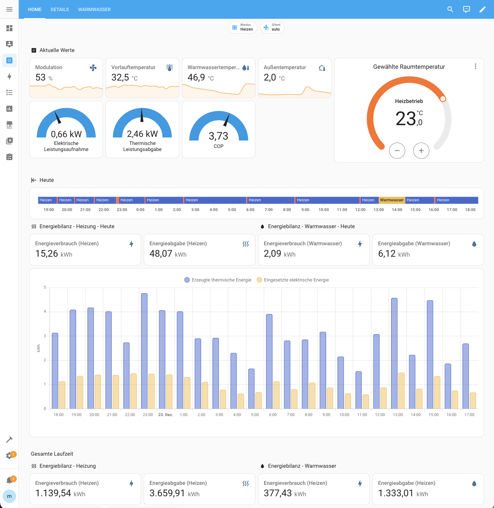

# Home Assistant Configurations for Bosch/Buderus Heat Pumps

This repository contains various configurations to use **Bosch Compress 5800/6800i & Buderus Logatherm WLW176/186** in Home Assistant.

A German explanation how to connect Bosch Compress 5800/6800i & Buderus Logatherm WLW176/186 to Home Assistant can be found on [https://bosch-buderus-wp.github.io/](https://bosch-buderus-wp.github.io/docs/smarthome/).

## Dashboards

## Simple Dashboards

[Configuration](./dashboards/)
