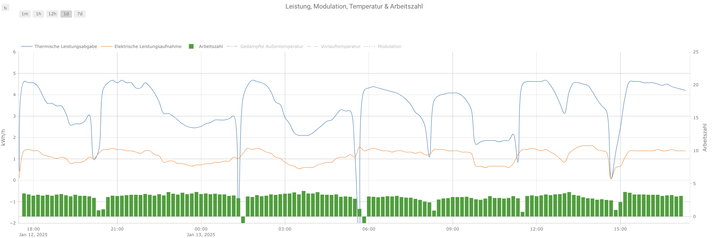

# Home Assistant Configurations for Bosch/Buderus Heat Pumps

This repository contains various configurations to use **Bosch Compress 5800/6800i & Buderus Logatherm WLW176/186** in [Home Assistant](https://www.home-assistant.io/).

A German explanation how to connect Bosch Compress 5800/6800i & Buderus Logatherm WLW176/186 to Home Assistant can be found on [https://bosch-buderus-wp.github.io/](https://bosch-buderus-wp.github.io/docs/smarthome/).

The samples in this repository assume that you configured your ems-esp [MQTT Settings](http://ems-esp/settings/mqtt) with `Entity ID format = Single, short name (v3.6)`.
If you use another format, you might need to adapt the entity names in the dashboards/cards.

## Dashboards

To use the following dashboard, simply create a new dashboard in the dashboard overview of the settings:

Then click on the pen on the top right of your new dashboard, click on the three dots on the top right and select the _Raw Configuration Editor_.
Paste the content of the configuration file linked under the dashboard below to the editor and save.

### Simple Dashboard

This simple dashboard visualizes basic entities of the heat pump like temperatures, power and energy consumption, heat output, COP, etc.
All necessary entities are provided by [ems-esp](https://emsesp.org/) and only built-in elements of Home Assistant are required - no need to install [HACS](https://hacs.xyz/).

[Configuration](./dashboards/simple-dashboard.yaml)

## Cards

To see even more details of your heat pump, you can add one the following cards to your dashboard.
The cards require the installation of [Plotly Graph Cards](https://github.com/dbuezas/lovelace-plotly-graph-card#installation) from [HACS](https://hacs.xyz/).
To add a card, create a new card first by pressing the _+_ icon on your dashboard and then select _Plotly Graph Card_ and open the _Code Editor_ on the bottom left of the pop-up.
Paste the configuration linked below in the _Code Editor_.

## Power - COP

[Configuration](./dashboards/power-cop_card.yaml)

_More cards will follow soon_
